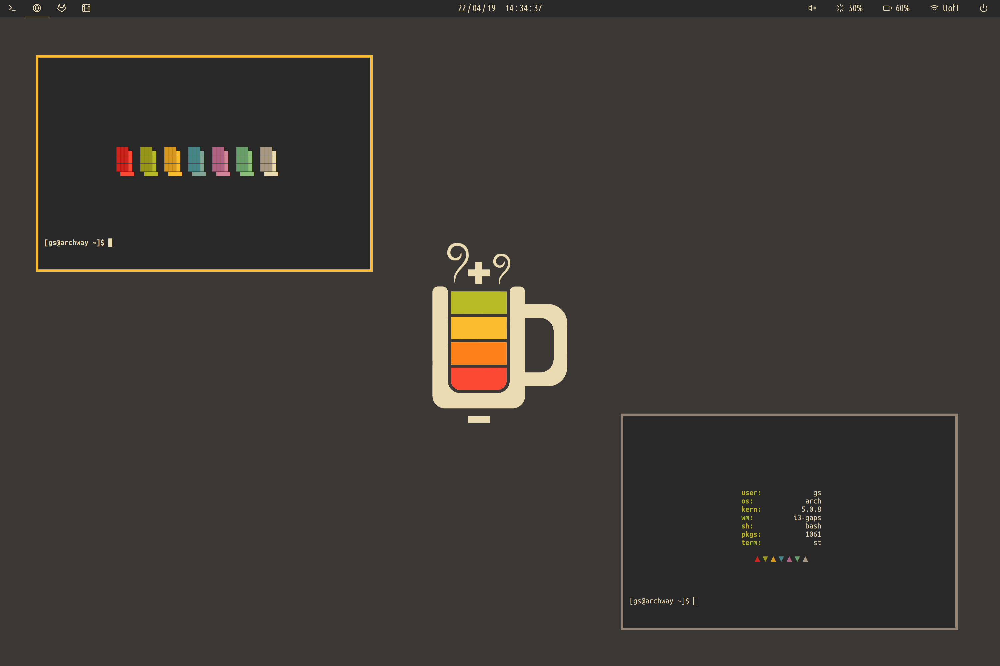

# Dotfiles
Arch Linux .files

## Info

* Shell: `bash`
* Window Manager: `i3-gaps`
* File Manager: `ranger`/`dolphin`
* Terminal: `st (patched)`
* Text Editor: `neovim`
* Bar: `polybar`
* dmenu: `rofi`
* colorscheme: 

[Wallpaper](http://i.imgur.com/PJbX0MG.png)

Check out my [bin repo](https://github.com/grahamsider/bin) for random small scripts I've created to make my life easier.

Current configuration:

* Huawei Matebook X Pro - Intel i7-8550U @ 4.0GHz - NVIDIA MX150 - 16GB LPDDR3 @ 2133MHz - 512GB NVMe SSD

## Screenshots

### Flat

