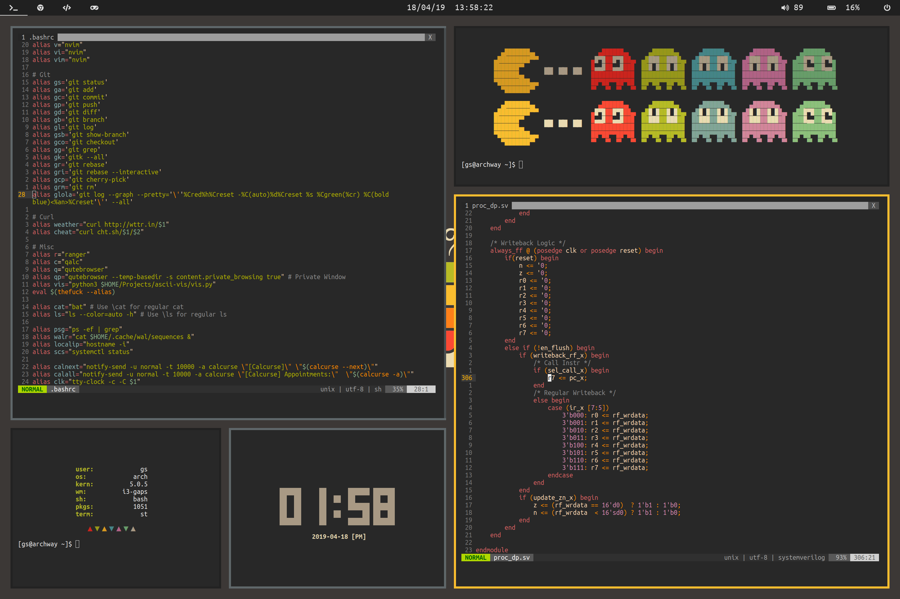
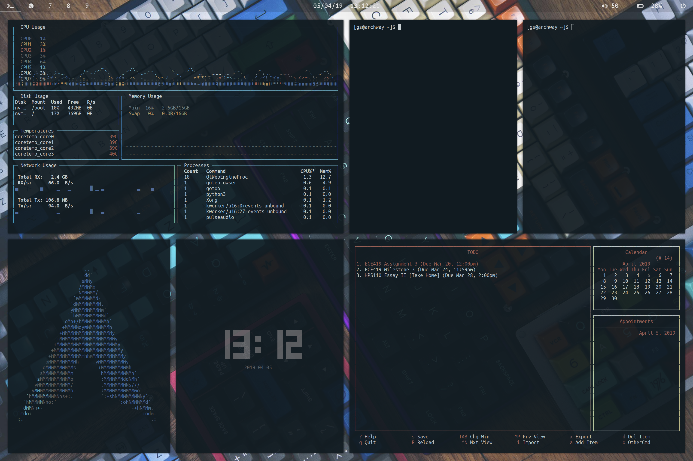

# Dotfiles
Arch Linux .dotfiles.

Two configurations:
    
- Flat
- Composite

## Info

- Shell: `bash`
- Window Manager: `i3-gaps`
- File Manager: `ranger`/`dolphin`
- Terminal: `st (patched)`
- Compositor: 
    - Flat: `n/a`
    - Composite: `compton`
- Text Editor: `neovim`
- Bar: `polybar`
- dmenu: `rofi`
- colorscheme: 
    - Flat: `gruvbox`
    - Composite: `pywal`

[Flat-Gruvbox background](http://i.imgur.com/PJbX0MG.png)

[Composite-Pywal background](https://i.redd.it/387vx69mzkcx.jpg)

Check out my [bin repo](https://github.com/grahamsider/bin) for random small scripts I'm making to make my life easier.

Current configurations:
- Huawei Matebook X Pro - Intel i7-8550U @ 4.0GHz - NVIDIA MX150 - 16GB LPDDR3 @ 2133MHz - 512GB NVMe SSD
- Dell Inspiron 7559 (Dual Booting with Windows 10) - Intel i5-6300HQ @ 2.3GHz - NVIDIA GTX 960M - 8GB DDR3L @ 1600MHz - 1TB Hybrid HDD @ 5400RPM

## Screenshots

### Flat

### Composite

