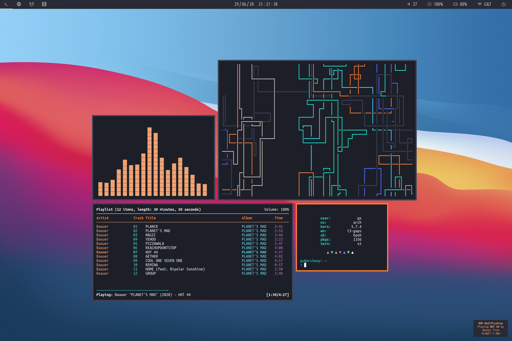

# Dotfiles
Arch Linux .files

## Info

* Shell: `bash`
* Window Manager: `i3-gaps`
* Terminal: `st (patched)`
* Text Editor: `neovim`
* Bar: `polybar`
* Notification Daemon: `dunst`
* dmenu: `rofi`

## Screenshots

